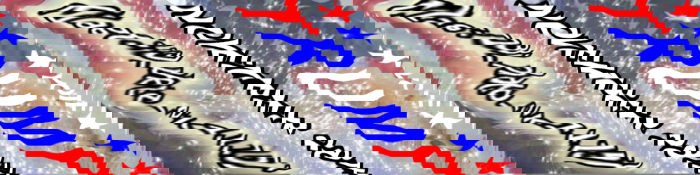
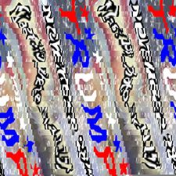
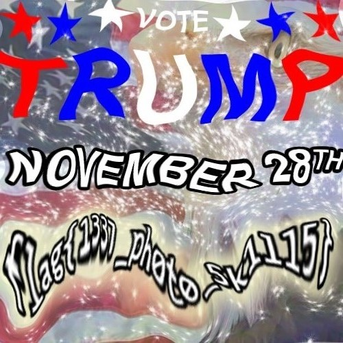

# Hack the Vote 2016: Warp Speed

**Category:** Forensics
**Points:** 100
**Solves:** 325
**Description:**

Our Trump advertising campaign is incredible, it's skyrocketing! It's astronomical! Wait stop!! SLOW DOWN!!!

[warp_speed](warp_speed.jpg)

author's irc nick: krx

## Write-up

So we are given an image...

xxd warp_speed.jpg
I. .a. m. .a. . s.q.u.a. r.e... . A.n.y.o. n.e. .w. h.o. .t. e.l.l.s. .y.o.u. .o.t.h. e.r.w.i. s.e. .i. s. .a. . L.I.A.R. !...

So I resized the image 

It looks like the flag is just cut up and scrambled. A bit of paint and voila we have the flag. 

EDIT:

So a more elegant way to solve this challenge is to change the size of the picture in the jpeg heading directly. So you'd get this:

### Flag

`flag{1337_ph0t0_5k1ll5}`

